# 단국대 커뮤니티

단국대 커뮤니티 만들기

### Description
- 2015-6년 정도에 만듦

### Page Description
- 홈
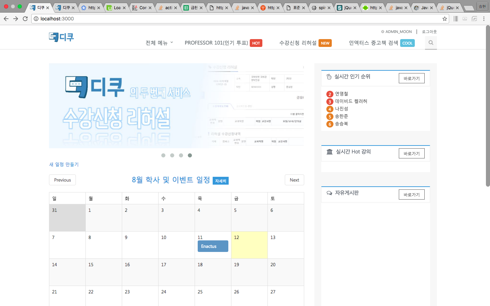

- 회원관리

- 강의평가
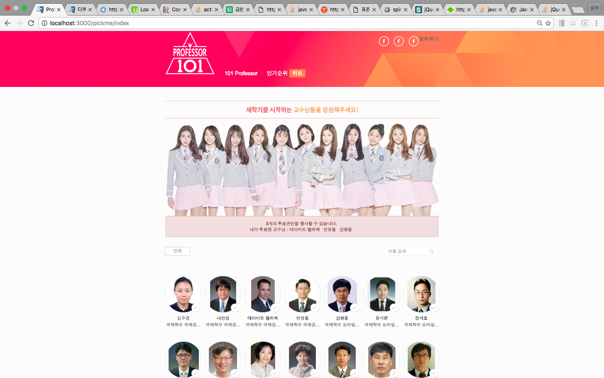
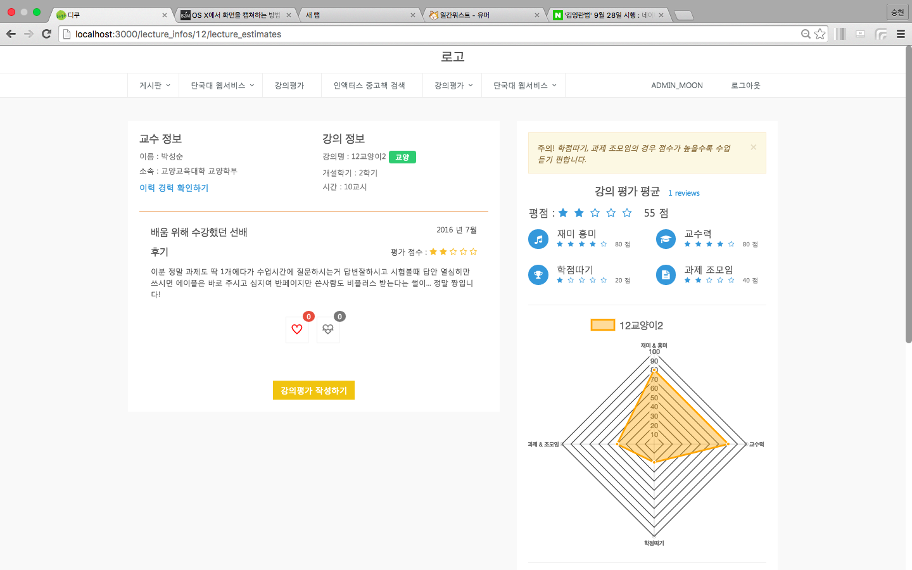
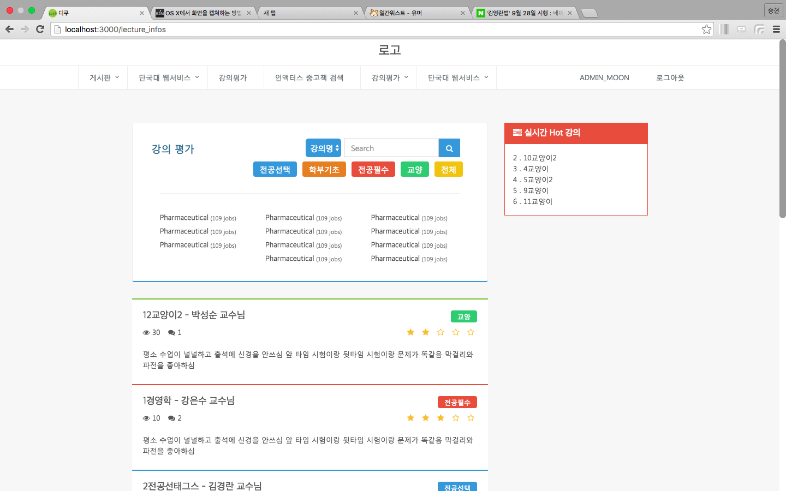


- 커뮤니티
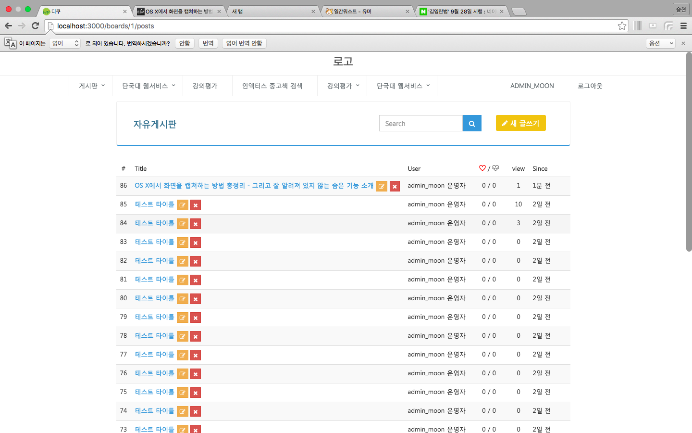
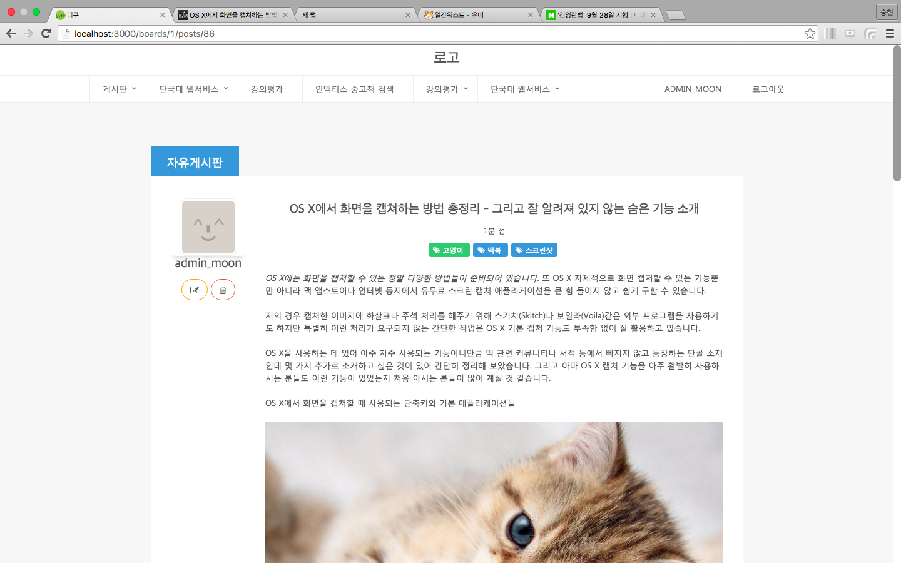
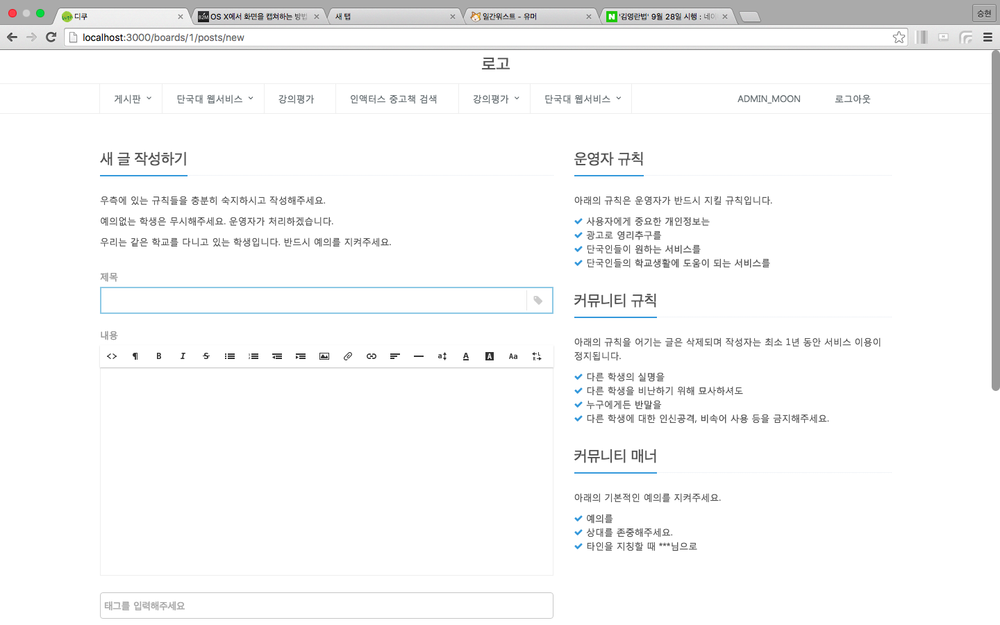
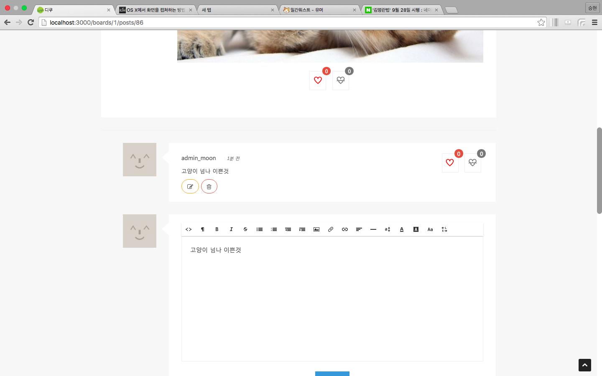

- 단국대 이벤트 달력
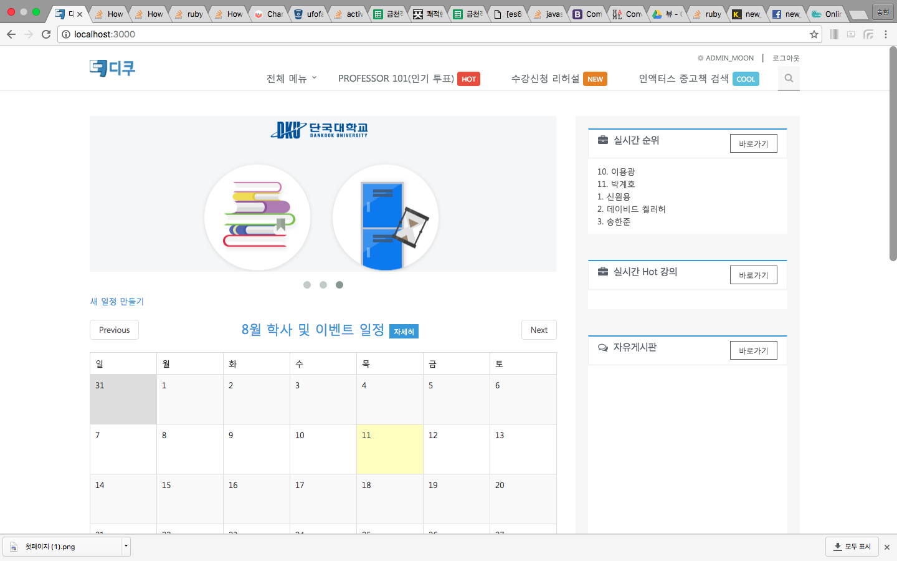

- 관리자 페이지
- 인엑터스 중고책 온라인 예약
데스크탑
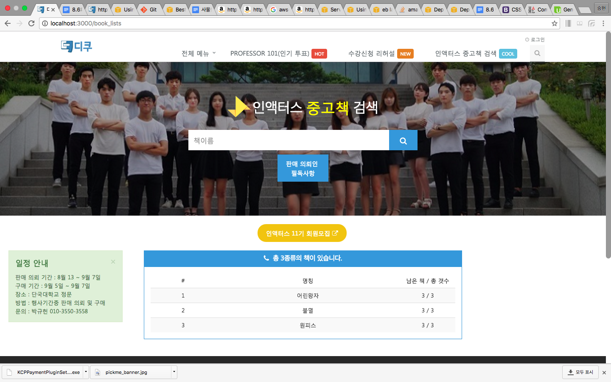


모바일
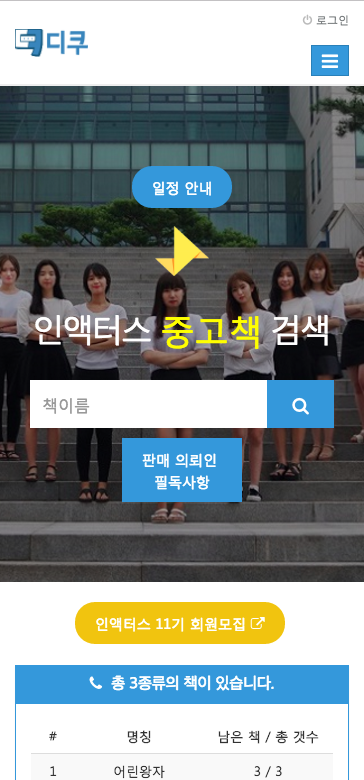


포스터
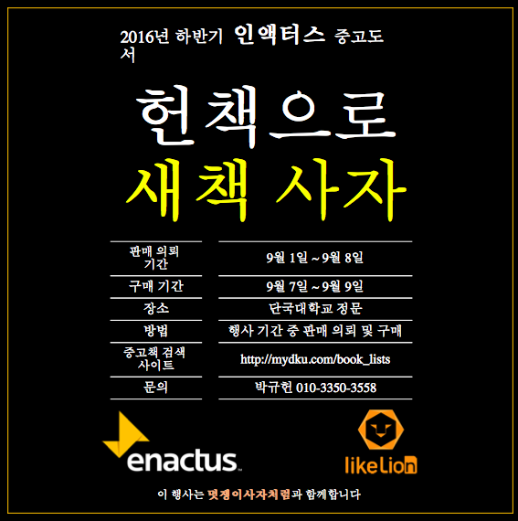


- Professor101 (교수 인기투표)

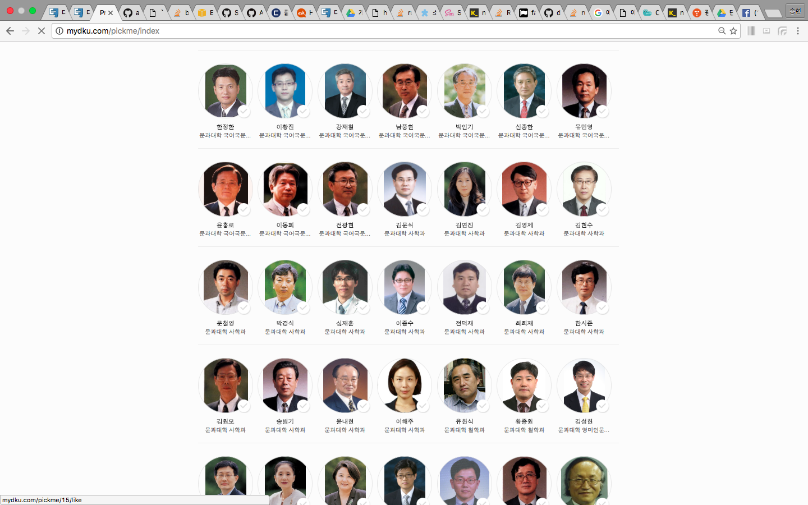
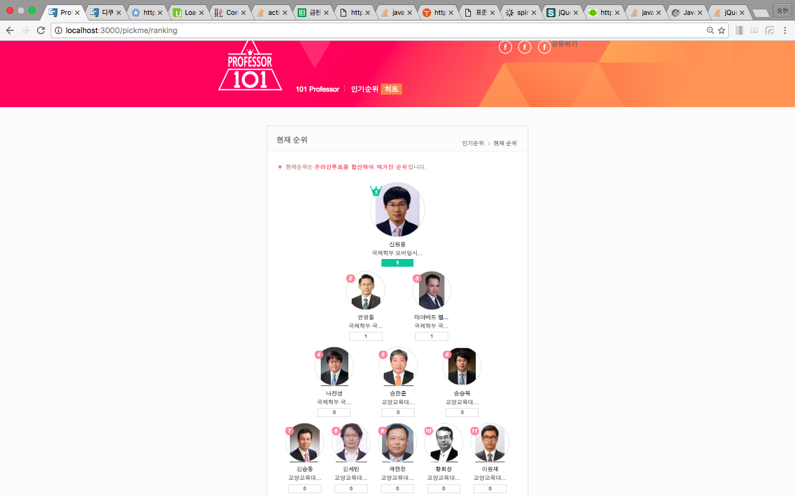

- 학교 부서 전화번호 검색 (크롤링 후 디비 저장)
- 국제학부 (국제경영학과 & 모바일 시스템학과) 사물함 & 중고책 예약
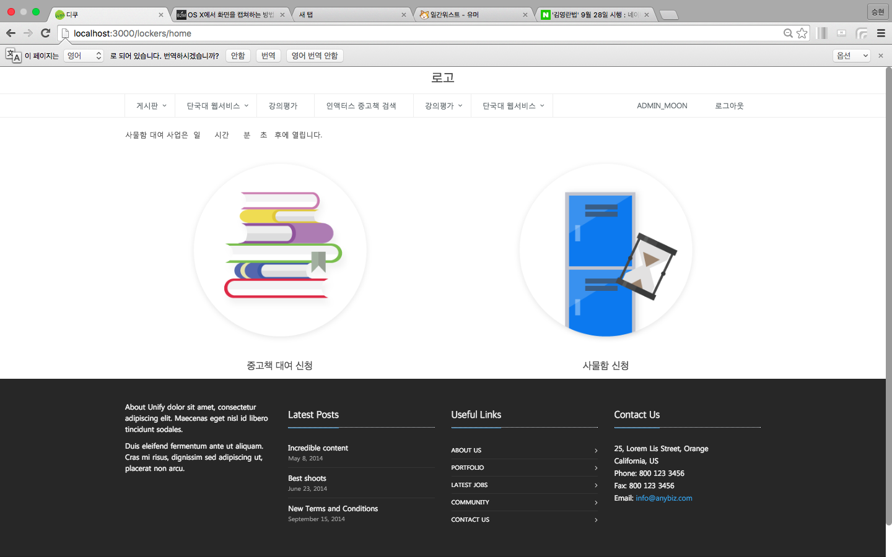

- 강의신청 모의 테스트 (강의신청 연습 사이트)


### Installing

라이브러리 설치

```
$ bundle install 
```

서버시작

```
$ rails s
```

## Built With
- 언어 : Ruby
- 프레임 워크 : Rails
- 데이터베이스 : Sqlite3
